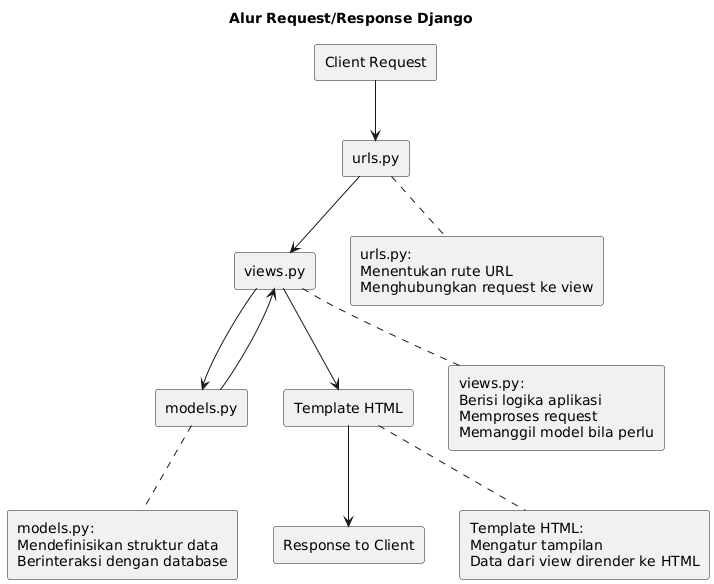

# Q & A
---
## **Jelaskan bagaimana cara kamu mengimplementasikan checklist di atas secara step-by-step** 
> Pertama, yang saya lakukan adalah melihat kembali tutorial 0 dan 1. Lalu, saya membuat note yang berisi step-by-step cara seperti memulai proyek Django, men-deploy proyek saya ke github dan PWS, dan memastikan menghindari kesalahan fatal dengan melihat troubleshoot section pada page tutorial sebelumnya.

## **Buatlah bagan yang berisi request client ke web aplikasi berbasis Django beserta responnya dan jelaskan pada bagan tersebut kaitan antara `urls.py`, `views.py`, `models.py`, dan berkas html**
> 

## **Jelaskan peran settings.py dalam proyek Django!**
Pada settings.py, kita bisa melakukan beberapa hal:
	 1. Menkonfigurasi website apakah dalam mode debugging atau production
	 2. Membantu menghubungi main page dengan database
	 3. Menambahkan aplikasi baru yang nanti bisa kita hubungi dengan direktori utama website kita (yaitu warung_football dalam konteks ini)
> Kesimpulan yang bisa didapatkan adalah settings.py berguna sebagai layar belakang dibalik tampilan halaman utama, alamat yang ingin dikirim informasinya, dan penghubung aplikasi kita.
## **Bagaimana cara kerja migrasi database di Django?**

## **Menurut Anda, dari semua framework yang ada, mengapa framework Django dijadikan permulaan pembelajaran pengembangan perangkat lunak?**
> framework Django ditulis dengan bahasa pemrograman Python, yang sebelumnya telah kita pelajari di semester sebelumnya. Lalu, Django bisa dibilang sangat terbuka bagi programmer pemula tidak perlu dipusingi dengan membuat __frontend__ dan __backend__ dari nol.

## **Apakah ada feedback untuk asisten dosen tutorial 1 yang telah kamu kerjakan sebelumnya?**
> Saya hanya harap tim asisten dosen selalu semangat untuk membantu dan mengarahkan mahasiswa PBP semester ganjil sehingga menanami rasa semangat dan kepercayaan koding untuk mata kuliah dan karir selanjutnya.