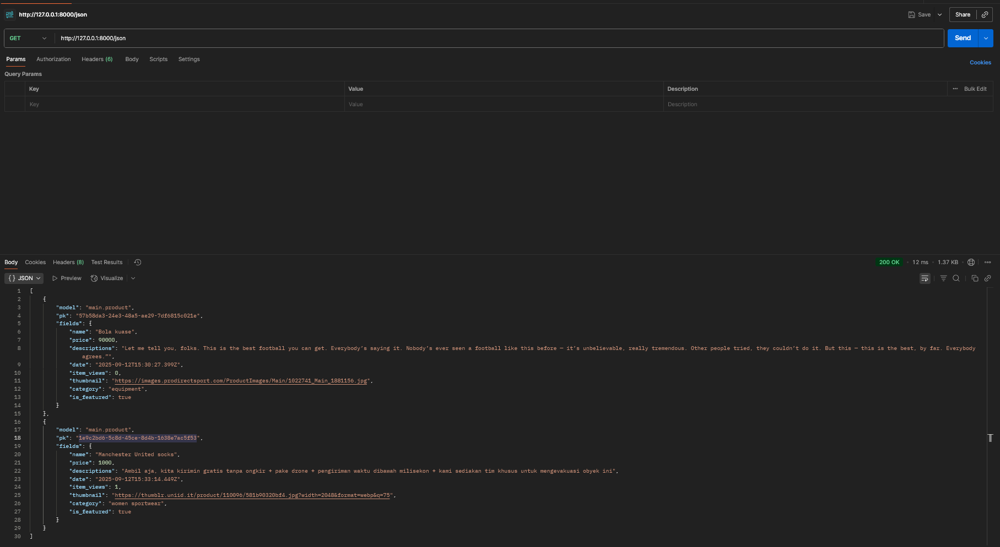
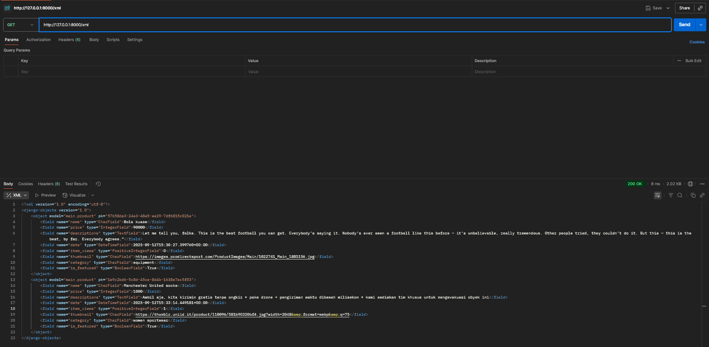

# Request XML dan JSON melalui POSTMAN

---

# Q & A

## Jelaskan mengapa kita memerlukan data delivery dalam pengimplementasian sebuah platform?*
Setiap hari, sebuah aplikasi menerima ribuan data yang masuk dan keluar. Tentunya kita harus memerlukan begitu banyak hubungan antar _client_(melalui browser atau aplikasi perangkat seperti _handphone_) dan _server_ (sebagai tempat yang menyediakan basis data dan informasi lainnya). Mekanisme pengantaran data memastikan data dapat dipertukarkan secara konsisten, aman, dan sesuai format yang bisa dipahami kedua belah pihak. Tanpa pengantaran data, integrasi antara komponen _platform_ akan rapuh, sulit dikembangkan, dan rawan _error_

## Menurutmu, mana yang lebih baik antara XML dan JSON? Mengapa JSON lebih populer dibandingkan XML? 
Kedua format ini memiliki kelebihannya masing-masing: XML cocok untuk mendukung atribut dan _nested tags_, sedangkan JSON yang strukturnya mirip JavaScript dipandang lebih efisien dalam ukuran dan mudah dibaca untuk manusia. Tetapi mengapa JSON lebih dominan dibandingkan format-format lainnya? hal ini karena JSON sering dipakai untuk mekanisme pembuatan _Application Programming Interface_ (atau disingkat API) yang memudahkan aplikasi perangkat untuk berkomunikasi, menukarkan data, dan menstrukturkan bagaimana sebuah _request_ dikendalikan.

## Jelaskan fungsi dari method is_valid() pada form Django dan mengapa kita membutuhkan method tersebut?
`is_valid()` memiliki kegunaan penting, yaitu mengecek apakah data yang dikirim sesuai dengan struktur dan tipe field yang ditentukan. Saat kita membuat field baru di class kita pada `models.py`, kita menuliskan batasan-batasan seperti jumlah karakter tidak boleh lebih dari 35 atau sejenisnya. 

Tanpa fungsi tersebut, kita tidak bisa menentukan apakah input dari pengguna adalah valid atau invalid sehingga tidak membuat error pada basis data. Segala bentuk untuk meng-input data yang sembarangan seperti format salah, nilai null pada field wajib, atau _inject_ kode berbahaya adalah contoh dari sekian keperluan fungsi itu.

## Mengapa kita membutuhkan csrf_token saat membuat form di Django? Apa yang dapat terjadi jika kita tidak menambahkan csrf_token pada form Django? Bagaimana hal tersebut dapat dimanfaatkan oleh penyerang?

`csrf_token` berfungsi sebagai token unik yang dimasukkan pada setiap form untuk memastikan request benar-benar berasal dari sumber sah (origin aplikasi) dan bukan pihak luar. Jika tidak ada, aplikasi menjadi rentan terhadap Cross-Site Request Forgery (CSRF), yaitu serangan di mana penyerang memanipulasi pengguna agar tanpa sadar mengirim request berbahaya (misalnya transaksi atau pengubahan data) ke server menggunakan session korban yang masih aktif.

## Jelaskan bagaimana cara kamu mengimplementasikan checklist di atas secara step-by-step (bukan hanya sekadar mengikuti tutorial).

1.) Saya memastikan kalau isi dari direktori saya sesuai sehingga tidak ada berkas yang belum diciptakan agar tidak error di tengah jalan
2.) Karena saya sudah buat class baru di `models.py`, maka saya hanya membuat class Form pada `forms.py` sesuai dengan nama Object saya di berkas sebelumnya. lalu saya tuliskan fields yang relevan dengan apa yang saya sudah tentukan (dan menghindari fields yang otomatis telah ditambah, tanpa input manual)
3.) Pada `views.py`, saya siapkan fungsi yang berguna untuk menambahkan produk baru dan menampilkan seluruh produk yang ada pada basis data saya. Habis itu, saya memodifikasi `main.html` agar bisa memuat fungsi-fungsi tadi
4.) Untuk menyiapkan pengembalian data (atau _data delivery_), saya kembali lagi ke `views.py` untuk mengimpor _library_ yang berguna untuk mengembalikan sebuah data dalam format XML atau JSON. Setelah selesai, saya menambahkan _path_ URLS ke `urls.py` dan menjalankan fungsi tadi.
5.) Hasil dari langkah sebelumnya bisa saya verifikasi lewat aplikasi Postman untuk mengirim _request_ buat data yang diingikan dalam dua format tadi lalu akan ditampilkan.

## Apakah ada feedback untuk asdos di tutorial 2 yang sudah kalian kerjakan?
Menurut saya asdos-nya bisa lebih aktif lagi, terus bisa selalu menjaminkan mahasiswa yang sedang mengikuti mata kuliah ini agar dipermudahkan penilaiannya dan bisa lulus. 